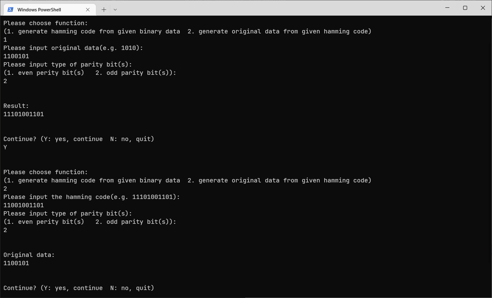

# 汉明码(Hamming Code)生成工具

## 功能列表

- 由原始二进制数据生成相应的汉明码
- 由汉明码得到原始二进制数据（含检错过程）

## 执行过程

如果用中文提示可能有乱码，翻译一下：

- **选择功能** 
   Please choose function:  
   (1. generate hamming code from given binary data  2. generate original data from given hamming code) 
   请选择功能： 
   （1. 由所给二进制数据生成汉明码  2. 由所给汉明码生成原始数据） 

  - **1. 由所给二进制数据生成汉明码** 
    Please input original data(e.g. 1010):  
    请输入原始数据（例如1010）：

    Please input type of parity bit(s):  
    (1. even perity bit(s)   2. odd parity bit(s)): 
    请输入校验位类型： 
    （1. 偶校验  2. 奇校验）： 
  - **2. 由所给汉明码生成原始数据** 
    Please input the hamming code(e.g. 11101001101):  
    请输入汉明码（例如11101001101）：

    Please input type of parity bit(s):  
    (1. even perity bit(s)   2. odd parity bit(s)): 
    请输入校验位类型： 
    （1. 偶校验  2. 奇校验）： 

## 运行示意图

